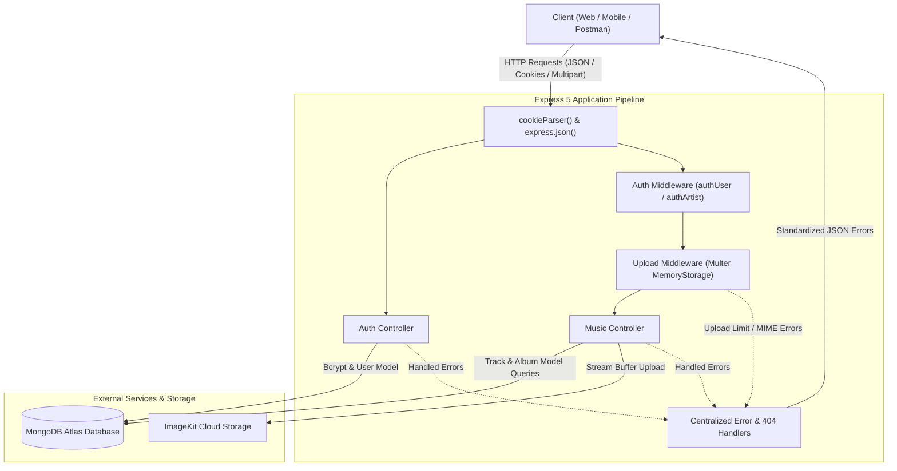
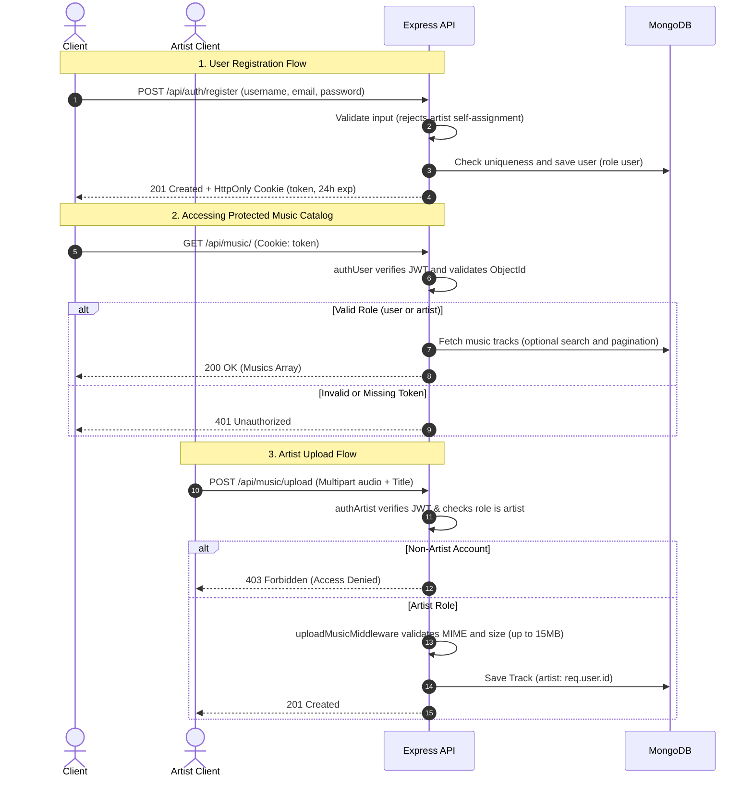

# Coda (Melodify) Backend API

[](https://nodejs.org/)
[](https://expressjs.com/)
[](https://www.mongodb.com/)
[](https://imagekit.io/)
[](file:///d:/coda/test)

A secure, high-performance RESTful backend API for **Coda (Melodify)**, a music streaming and media management platform. Built with Node.js, Express 5, and MongoDB, featuring hardened JWT authentication, role-based access control, safe media streaming uploads via ImageKit, pagination, case-insensitive search, and centralized error handling.

---

## Table of Contents

1. [Architecture Overview](#architecture-overview)
   - [System Architecture](#system-architecture)
   - [Authentication & Authorization Flow](#authentication--authorization-flow)
2. [Features](#features)
3. [Technology Stack](#technology-stack)
4. [Project Structure](#project-structure)
5. [Environment Variables](#environment-variables)
6. [Getting Started](#getting-started)
   - [Prerequisites](#prerequisites)
   - [Installation](#installation)
   - [Running the Server](#running-the-server)
7. [API Reference](#api-reference)
   - [Authentication Endpoints](#authentication-endpoints)
   - [Music & Album Endpoints](#music--album-endpoints)
8. [Request & Response Examples](#request--response-examples)
9. [Security & Design Decisions](#security--design-decisions)
10. [Testing](#testing)
11. [Known Limitations & Roadmap](#known-limitations--roadmap)
12. [License](#license)

---

## Architecture Overview

### System Architecture



### Authentication & Authorization Flow



---

## Features

- **Role-Based Access Control (RBAC)**: Distinct permissions for standard listeners (`user`) and creators (`artist`). Standard registration prevents listeners from self-promoting to the `artist` role.
- **Hardened JWT Authentication**: JSON Web Tokens with a strict 24-hour expiration (`exp`), signed with server secrets and delivered via `HttpOnly`, `SameSite=Strict` cookies (with conditional `secure: true` in production). Fallback support for `Authorization: Bearer <token>` headers.
- **Strict Input Validation**: Reusable validation rules for usernames, emails (regex), passwords (minimum 6 characters), roles, and MongoDB `ObjectId` format checking across all routes.
- **Safe Audio Uploads**: Enforces in-memory buffer storage via Multer, a strict 15MB file size limit, and audio MIME-type validation (`audio/mpeg`, `audio/mp3`, `audio/wav`, `audio/ogg`, `audio/flac`, `audio/aac`, etc.).
- **Resource Ownership Verification**: Artists can only add tracks they personally created to albums. Attempts to include tracks belonging to other artists are rejected with `403 Forbidden`.
- **Search & Pagination**: Case-insensitive track title searching with regex sanitization, customizable `page` and `limit` query parameters with pagination metadata (`total`, `totalPages`), and backward-compatible unpaginated catalog responses.
- **Centralized Error Handling**: Standardized JSON error responses `{ "message": "..." }` across the entire application, including custom `404 Not Found` routing, malformed JSON body interceptors, and Multer/Mongoose error translation.

---

## Technology Stack

| Layer | Technology | Details |
| :--- | :--- | :--- |
| **Runtime** | [Node.js](https://nodejs.org/) | v20+ recommended (ES Modules & CommonJS compatibility) |
| **Framework** | [Express](https://expressjs.com/) | v5.2.1 |
| **Database & ODM** | [MongoDB](https://www.mongodb.com/) / [Mongoose](https://mongoosejs.com/) | Mongoose v9.10.4 |
| **Authentication** | [jsonwebtoken](https://github.com/auth0/node-jsonwebtoken) & [bcryptjs](https://github.com/dcodeIO/bcrypt.js) | JWT v9.0.3, bcryptjs v3.0.3 |
| **Cookie Parser** | [cookie-parser](https://github.com/expressjs/cookie-parser) | v1.4.7 |
| **File Uploads** | [Multer](https://github.com/expressjs/multer) | v2.4.0 (In-memory storage) |
| **Cloud Storage** | [@imagekit/nodejs](https://imagekit.io/) | v7.12.1 |
| **Configuration** | [dotenv](https://github.com/motdotla/dotenv) | v18.0.5 |
| **Testing** | Node.js Test Runner | Native `node:test` & `node:assert/strict` |

---

## Project Structure

```
d:/coda/
├── .env                              # Environment variables (ignored by git)
├── .gitignore                        # Git ignore patterns
├── package.json                      # NPM configuration & dependencies
├── package-lock.json                 # Locked dependency tree
├── server.js                         # Application entrypoint & database bootstrap
├── src/
│   ├── app.js                        # Express app, middleware configuration, routes
│   ├── controllers/
│   │   ├── auth.controller.js        # User registration, login, logout logic
│   │   └── music.controller.js       # Music uploads, album CRUD, search, pagination
│   ├── db/
│   │   └── db.js                     # MongoDB connection setup
│   ├── middlewares/
│   │   ├── auth.middleware.js        # authUser and authArtist JWT role guards
│   │   └── error.middleware.js       # Centralized 404 and error-handling middleware
│   ├── models/
│   │   ├── album.model.js            # Mongoose schema for albums
│   │   ├── music.model.js            # Mongoose schema for music tracks
│   │   └── user.model.js             # Mongoose schema for users and roles
│   ├── routes/
│   │   ├── auth.routes.js            # Auth routing (/api/auth)
│   │   └── music.routes.js           # Music routing & Multer middleware (/api/music)
│   └── services/
│       └── storage.service.js        # ImageKit cloud media upload service
└── test/
    ├── auth_and_music.test.js        # Core auth, role authorization, and ownership tests
    ├── error_handling.test.js        # 404 and centralized error handler tests
    ├── jwt_hardening.test.js         # Cookie security flags, expiration, and token checks
    ├── pagination_and_search.test.js # Title search and pagination test suite
    ├── upload.test.js                # Audio upload validation, size limits, and MIME checks
    └── validation.test.js            # Input validation and ObjectId format checks
```

---

## Environment Variables

Create a `.env` file in the project root directory with the following variables:

```env
PORT=3000
MONGO_URI=mongodb+srv://<username>:<password>@<cluster>.mongodb.net/melodify?retryWrites=true&w=majority
JWT_SECRET=your_super_secret_jwt_key_here
JWT_EXPIRES_IN=24h
IMAGEKIT_PRIVATE_KEY=your_imagekit_private_key
NODE_ENV=development
```

| Variable | Description | Default / Example |
| :--- | :--- | :--- |
| `PORT` | Local port the HTTP server binds to | `3000` |
| `MONGO_URI` | MongoDB connection URI string | `mongodb+srv://...` |
| `JWT_SECRET` | Secret key used to sign and verify JSON Web Tokens | Required |
| `JWT_EXPIRES_IN` | Token validity lifespan | `24h` |
| `IMAGEKIT_PRIVATE_KEY` | Private API key for ImageKit cloud uploads | Required for uploads |
| `NODE_ENV` | Application environment (`development` / `production`) | `development` |

---

## Getting Started

### Prerequisites

- **Node.js**: v18.0.0 or higher (v20+ recommended)
- **MongoDB**: Active MongoDB database instance (local or MongoDB Atlas)
- **ImageKit Account**: Required for media uploads

### Installation

1. Clone the repository and navigate to the project directory:
   ```bash
   git clone https://github.com/shreyar04/melodify.git
   cd melodify
   ```

2. Install dependencies:
   ```bash
   npm install
   ```

3. Configure your `.env` file with valid database and credential strings.

### Running the Server

- **Development Mode** (with automatic restarts):
  ```bash
  npm run dev
  ```
- **Production Mode**:
  ```bash
  npm start
  ```
The server will start listening at `http://localhost:3000`.

---

## API Reference

### Authentication Endpoints

Base path: `/api/auth`

| Method | Endpoint | Access | Description |
| :--- | :--- | :--- | :--- |
| `POST` | `/api/auth/register` | Public | Register a new user account with `user` role. Rejects `artist` self-assignment. |
| `POST` | `/api/auth/login` | Public | Authenticate with username or email and password; issues JWT cookie. |
| `POST` | `/api/auth/logout` | Public | Clears authentication cookie and invalidates session. |

### Music & Album Endpoints

Base path: `/api/music`

| Method | Endpoint | Access | Description |
| :--- | :--- | :--- | :--- |
| `POST` | `/api/music/upload` | Artist | Upload an audio file (up to 15MB) with title to ImageKit cloud storage. |
| `POST` | `/api/music/album` | Artist | Create an album. Enforces that all included tracks belong to the artist. |
| `GET` | `/api/music/` | User / Artist | Retrieve music tracks with optional `search`, `page`, and `limit` query parameters. |
| `GET` | `/api/music/albums` | User / Artist | Retrieve list of all albums with populated artist metadata. |
| `GET` | `/api/music/albums/:albumId` | User / Artist | Retrieve an album by ID with populated artist and track details. |

---

## Request & Response Examples

### 1. User Registration

**Request:**
```bash
curl -X POST http://localhost:3000/api/auth/register \
  -H "Content-Type: application/json" \
  -d '{
    "username": "melodylover",
    "email": "listener@example.com",
    "password": "strongPassword123"
  }'
```

**Response (`201 Created`):**
```json
{
  "message": "User registered successfully",
  "user": {
    "id": "670351234abcd56789ef0123",
    "username": "melodylover",
    "email": "listener@example.com",
    "role": "user"
  }
}
```

### 2. User Login

**Request:**
```bash
curl -X POST http://localhost:3000/api/auth/login \
  -H "Content-Type: application/json" \
  -d '{
    "username": "melodylover",
    "password": "strongPassword123"
  }'
```

**Response (`200 OK`):**
```json
{
  "message": "User logged in successfully",
  "user": {
    "id": "670351234abcd56789ef0123",
    "username": "melodylover",
    "email": "listener@example.com",
    "role": "user"
  }
}
```
*Note: Sets `Set-Cookie: token=<jwt>; Path=/; HttpOnly; SameSite=Strict; Max-Age=86400`.*

### 3. Music Upload (Artist Only)

**Request:**
```bash
curl -X POST http://localhost:3000/api/music/upload \
  -H "Cookie: token=<artist_token>" \
  -F "title=Midnight Serenade" \
  -F "music=@/path/to/audio.mp3;type=audio/mpeg"
```

**Response (`201 Created`):**
```json
{
  "message": "Music created successfully",
  "music": {
    "id": "67035a987fedcba654321098",
    "uri": "https://ik.imagekit.io/cacaw4q6w/yt-complete-backend/music/audio_abc123.mp3",
    "title": "Midnight Serenade",
    "artist": "670351234abcd56789ef0123"
  }
}
```

### 4. Create Album with Ownership Enforcement

**Request:**
```bash
curl -X POST http://localhost:3000/api/music/album \
  -H "Content-Type: application/json" \
  -H "Cookie: token=<artist_token>" \
  -d '{
    "title": "Acoustic Nights",
    "musics": [
      "67035a987fedcba654321098"
    ]
  }'
```

**Response (`201 Created`):**
```json
{
  "message": "Album created successfully",
  "album": {
    "id": "67035b111222333444555666",
    "title": "Acoustic Nights",
    "artist": "670351234abcd56789ef0123",
    "musics": [
      "67035a987fedcba654321098"
    ]
  }
}
```

*If an artist attempts to add a track belonging to another artist, the API rejects with `403 Forbidden`:*
```json
{
  "message": "You don't have permission to add music that is not yours"
}
```

### 5. Listing Music with Pagination & Search

**Request:**
```bash
curl -X GET "http://localhost:3000/api/music/?search=Serenade&page=1&limit=5" \
  -H "Cookie: token=<auth_token>"
```

**Response (`200 OK`):**
```json
{
  "message": "Musics fetched successfully",
  "musics": [
    {
      "_id": "67035a987fedcba654321098",
      "title": "Midnight Serenade",
      "uri": "https://ik.imagekit.io/cacaw4q6w/yt-complete-backend/music/audio_abc123.mp3",
      "artist": {
        "_id": "670351234abcd56789ef0123",
        "username": "melodylover",
        "email": "listener@example.com"
      }
    }
  ],
  "page": 1,
  "limit": 5,
  "total": 1,
  "totalPages": 1
}
```

### 6. Centralized Error Responses

- **Malformed JSON Payload (`400 Bad Request`):**
  ```json
  {
    "message": "Invalid JSON format in request body"
  }
  ```

- **Unmapped Route (`404 Not Found`):**
  ```json
  {
    "message": "Route not found"
  }
  ```

- **File Size Exceeded (`400 Bad Request`):**
  ```json
  {
    "message": "File size exceeds limit. Maximum allowed size is 15MB"
  }
  ```

- **Unauthorized Access (`401 Unauthorized`):**
  ```json
  {
    "message": "Unauthorized"
  }
  ```

---

## Security & Design Decisions

1. **Role-Based Authorization Architecture**:
   - The platform strictly separates `user` and `artist` personas.
   - Standard listeners cannot self-promote to `artist` during registration (`/api/auth/register`).
   - `authArtist` enforces that only verified creator accounts can upload audio or publish albums.
   - `authUser` allows both `user` and `artist` accounts to access listener routes, ensuring artists can browse the catalog.

2. **JWT Security & Expiration**:
   - Tokens are signed with a mandatory 24-hour expiration (`expiresIn: "24h"`).
   - Cookies are configured with `httpOnly: true` (preventing XSS script reading), `sameSite: "strict"` (mitigating CSRF), and conditionally `secure: true` when running in production.
   - Authentication middleware inspects both cookies and the standard `Authorization: Bearer <token>` header.

3. **Media Upload Hardening**:
   - Uploads are processed in-memory (`multer.memoryStorage()`) to prevent insecure temporary file persistence on disk.
   - Validation checks MIME types (`audio/mpeg`, `audio/mp3`, `audio/wav`, etc.) and ensures positive buffer length (`> 0 bytes`).
   - File size is strictly capped at 15 MB to mitigate Denial-of-Service (DoS) and memory exhaustion vectors.

4. **Resource Ownership Integrity**:
   - Album creation verifies that every single track ID belongs directly to the authenticated artist in MongoDB.
   - Cross-artist track inclusion is prevented with HTTP `403 Forbidden`.

5. **Centralized Error Isolation**:
   - All errors are formatted into predictable JSON payloads: `{ "message": "..." }`.
   - Internal stack traces and database error structures are shielded from client responses in production.

---

## Testing

The project uses the Node.js native test runner (`node:test` and `node:assert/strict`) configured with sequential execution (`--test-concurrency=1`) to prevent race conditions during shared database teardowns.

### Running Tests

Execute the full automated test suite:

```bash
npm test
```

### Test Suite Breakdown

| Suite File | Scope | Test Count | Status |
| :--- | :--- | :---: | :---: |
| `test/auth_and_music.test.js` | Core authentication, RBAC authorization, and album ownership checks | 9 | Passed |
| `test/validation.test.js` | Username, email, password, role input validation, and MongoDB ObjectId checks | 18 | Passed |
| `test/upload.test.js` | File size limits, audio MIME validation, empty file rejections, and storage integration | 9 | Passed |
| `test/pagination_and_search.test.js` | Case-insensitive title search, regex safety, and pagination offsets | 11 | Passed |
| `test/jwt_hardening.test.js` | JWT expiration, secure cookie attributes, logout clearance, and invalid tokens | 6 | Passed |
| `test/error_handling.test.js` | 404 handler, JSON syntax error interceptors, and route preservation | 4 | Passed |
| **Total** | **Comprehensive Full-Stack Backend Coverage** | **57 Tests** | **All Passing** |

All **57 tests** pass with 100% success rate.

---

## Known Limitations & Roadmap

### Known Limitations
- **Single File Upload**: Currently, `/api/music/upload` accepts a single audio file per request.
- **Audio Transcoding**: Uploaded audio tracks are stored in their native uploaded formats without server-side transcoding (e.g. HLS streaming or variable bitrates).
- **Public Catalog**: Albums and tracks are publicly browsable by any authenticated user; granular private track permissions are not currently implemented.

### Future Roadmap
- [ ] **Stream Tokenization**: Time-limited signed URLs for streaming media files.
- [ ] **Playlist System**: User-curated custom playlists with collaborative editing.
- [ ] **Audio Waveform Generation**: Waveform peak extraction during upload for waveform visualizations.
- [ ] **Social Features**: Artist followings, user favorites, and track play-count tracking.
- [ ] **Rate Limiting**: Rate-limiting middleware (e.g. `express-rate-limit`) on authentication and upload endpoints.

---

## License

This project is licensed under the [ISC License](file:///d:/coda/package.json).
